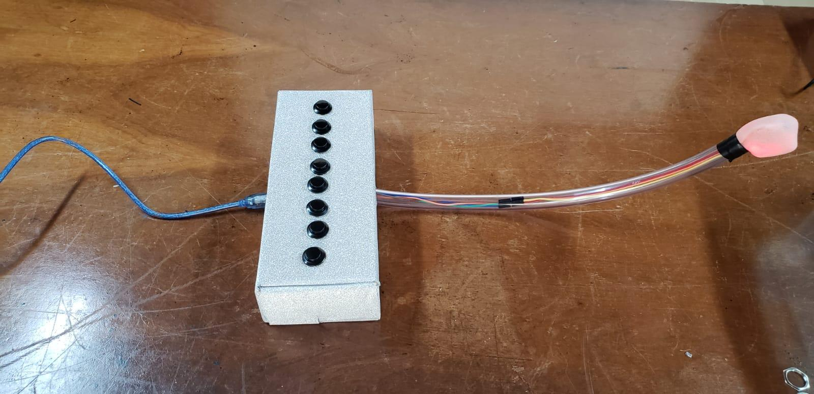

# AeroMidi
Repositório do instrumento AeroMidi, confeccionado para as matérias "Laboratório de Tecnologia Musical" e "Tópicos de Aplicação de Tecnologia à Composição Musical".

Desenvolvido por:
- Amanda Andrade Oliveira Ramos
- Giovanni Daldegan
- Keila Alves da Silva Gomes

## Ideia
O instrumento foi inspirado na escaleta, de forma que o controle é feito por teclas e sopro (detectado por um microfone).

## Estrutura e Funcionamento
O instrumento consiste em uma caixa com 8 botões, cada um correspondente a uma nota da escala maior de Dó (C maior), e um tubo com um microfone na ponta. Dentro da caixa, há uma placa eletrônica (circuitos fechados com solda, jumpers e pinos para contato com outros módulos) conectada a uma placa Arduino Uno.

  
  

O arduino é responsável por detectar a intensidade do sopro no microfone e qual tecla está sendo pressionada. Com essas medições, ele envia mensagens MIDI pela porta USB determinando a intensidade e a frequência da nota tocada. O sinal enviado chega a um computador que estiver executando o programa "atom" para escutar as mensagens MIDI e o Csound para sintetizar o som.

## Síntese sonora
A sonoridade do instrumento, sintetizada pela linguagem Csound, tenta imitar os harmônicos produzidos por uma ocarina. Utilizando geração de ruído, síntese subtrativa e ondas senoidais, o programa produz sons na frequência base da tecla e nos 2º, 3º, 5º e 7º harmônicos.
